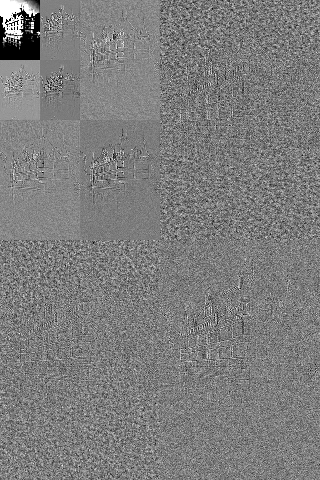
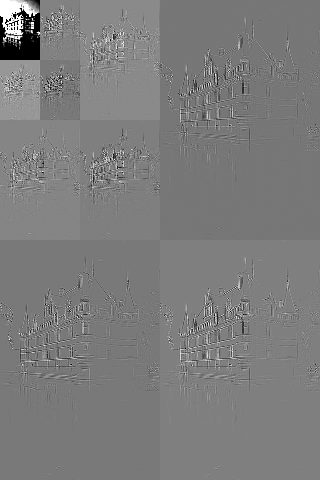
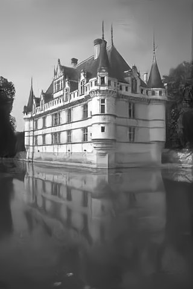

# RWNN
Andreas Floros, *Imperial College London, United Kingdom*

Abstract
----------
Image Restoration (IR) consists of a family of ill-posed inverse problems which have been studied extensively
through the lens of model and learning-based methods. Recent advances combining the two approaches have
allowed denoisers to solve general IR problems, thus reducing the complexity of the tasks to just denoising. In
this work, a multipurpose image processing tool is developed based on wavelet theory and Sparse Coding (SC).
The proposed method exploits the recursive nature of wavelet transforms to achieve high generalisation ability
and provides a powerful denoising engine. The utility of the proposed extends beyond traditional Additive
White Gaussian Noise (AWGN) removal; this flexibility is demonstrated in compact representation of images,
progressive loading, spatially variant noise removal, deblurring and inpainting.

RWNN-F: RWNN with Fusion Denoising
----------


The proposed architecture is a blind denoising neural network tailored for spatially variant Gaussian
noise removal.

A high level description of the model is shown in the above figure. It consists of
* a forward transform operator (RWNN)
* a processing step in the transformed domain (FusionNet)
* an inverse transform (RWNN<sup>−1</sup>) 

RWNN consists of a Lifting Inspired Neural Network (LINN) and a Noise Estimation Network (NENet) which predicts noise level maps Σ. It is responsible for separating
the clean signal (coarse) from noisy residuals (details). In the transformed domain, a denoising sub-network
based on the principles of SC is used to denoise the aforementioned residuals and the result, together with
the coarse, is back-projected to the original domain via RWNN−1. Note that RWNN-F may be repeated on the
coarse parts to obtain better results, if the noise variance is large.

| |  |  | |
|:---:|:---:|:---:|:---:|
|<i>(a) Noisy image, σ=25</i>|<i>(b) Noisy transformed</i>|<i>(c) Denoised transformed</i>|<i>(d) Denoised</i>|

RWNN-F is a divide and conquer algorithm which can be applied recursively on the coarse parts. An example application up to recursion depth 3 is shown above.

Installation
----------
* Create a virtual environment: `python -m venv env`
* Activate venv: `env\Scripts\activate`
* Install requirements: `pip install -r requirements.txt`


Training from scratch
----------
RWNN is trained in two steps, for the default settings proceed as follows:
* First run `python train.py --should_prepare True` to train in the Denoising AutoEncoder (DAE) setting
* Run `python train.py --dae False --epoch_start E` to fine-tune epoch E-1 for the final RWNN-F model

To explore hyperparameter settings use the `-h` flag. Inspect the `models` folder if you wish to tweak the networks.

Testing
----------
Pretrained RWNN-DAE and RWNN-F are found in the `logs` folder (epoch 41 and 73 respectively).
* `python test.py -h` for testing the networks in the DAE and denoising tasks.
* `python deblur.py -h` and `python inpaint.py -h` for Plug-and-Play Prior (P3) deblurring and inpainting respectively.

The default data for testing is Set12 and the results are included in the `examples` folder.

Citation
----------
```BibTex
@mastersthesis{floros2022beyond,
  author={Andreas Floros},
  title={{Beyond Wavelets: Wavelet-Inspired Invertible Neural Networks for Image Modelling and Approximation}},
  school={Imperial College London},
  year={2022}
}
```
